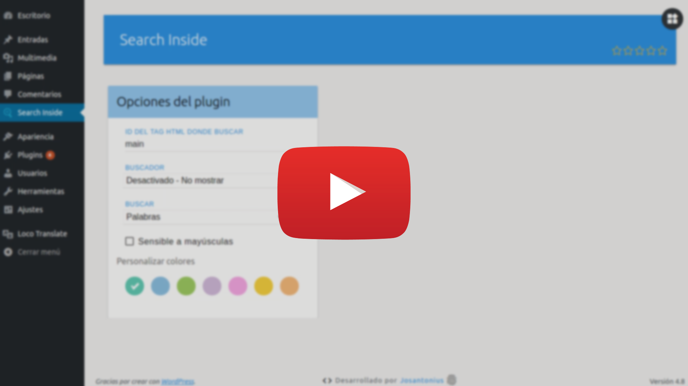

# Search Inside Wordpress Plugin

       

[English version](README.md)

Busca y remarca fácilmente frases o palabras en páginas y entradas.

---

- [Requisitos](#requisitos)
- [Instalación](#instalación)
- [Imágenes](#imagenes)
- [Tests](#tests)
- [Tareas pendientes](#-tareas-pendientes)
- [Contribuir](#contribuir)
- [Licencia](#licencia)
- [Copyright](#copyright)

---

Con Search Inside ahora puedes realizar búsquedas dentro de tus publicaciones o páginas en WordPress.

**Tienes varias formas para mostrar el buscador**

- El motor de búsqueda aparece cuando se pulsa cualquier tecla alfanumérica.

- Incrustrado en una etiqueta HTML.

- Insertarlo desde shortcode.

**Dos modos de búsqueda**

- Buscar frases completas.

- Buscar palabras separadas por espacios.

¡No olvides activar el modo sensible a mayúsculas y minúsculas si lo necesitas!

**Search Inside posee soporte completo para codificación UTF-8 y puede realizar búsquedas en cualquier idioma.**

  

## Requisitos

Este plugin es soportado por versiones de **PHP 5.6** o superiores y es compatible con versiones de **HHVM 3.0** o superiores.

## Instalación 

Puedes instalar este plugin desde el [repositorio oficial](https://es.wordpress.org/plugins/search-inside/) en WordPress.

Desde el panel de administración de WordPress:

	1. Entra en 'Plugins > Añadir Nuevo'
	2. Busca 'Search Inside'
	3. Activa Search Inside en tu página de plugins.

Desde WordPress.org:

	1. Descarga [Search Inside](https://es.wordpress.org/plugins/search-inside/).
	2. Sube el directorio 'search-inside' a tu directorio '/ wp-content / plugins /', usando tu método favorito (ftp, sftp, scp, etc ...).
	3. Activa Search Inside en tu página de plugins.

Una vez activado:

Entra en `Search Inside > Opciones` para configurar el plugin.

## Imágenes

### Tests 

Para ejecutar las [pruebas](tests) necesitarás [Composer](http://getcomposer.org/download/) y seguir los siguientes pasos:

    $ git clone https://github.com/josantonius/search-inside.git
    
    $ cd search-inside

    $ composer install

Ejecutar pruebas unitarias con [PHPUnit](https://phpunit.de/):

    $ composer phpunit

Ejecutar pruebas de estándares de código para [WordPress](https://github.com/WordPress-Coding-Standards/WordPress-Coding-Standards/) con [PHPCS](https://github.com/squizlabs/PHP_CodeSniffer):

    $ composer phpcs

Ejecutar pruebas con [PHP Mess Detector](https://phpmd.org/) para detectar inconsistencias en el estilo de codificación:

    $ composer phpmd

Ejecutar todas las pruebas anteriores:

    $ composer tests

## ☑ Tareas pendientes

- [ ] Agregar pruebas.
- [ ] Añadir nueva funcionalidad.
- [ ] Mejorar documentación.
- [ ] Refactorizar código para las reglas de estilo de código deshabilitadas. Ver [phpmd.xml](phpmd.xml) y [.php_cs.dist](.php_cs.dist).

## Contribuir

Si deseas colaborar, puedes echar un vistazo a la lista de
[issues](https://github.com/josantonius/search-inside/issues) o [tareas pendientes](#-tareas-pendientes).

**Pull requests**

* [Fork and clone](https://help.github.com/articles/fork-a-repo).
* Ejecuta el comando `composer install` para instalar dependencias.
  Esto también instalará las [dependencias de desarrollo](https://getcomposer.org/doc/03-cli.md#install).
* Ejecuta el comando `composer fix` para estandarizar el código.
* Ejecuta las [pruebas](#tests).
* Crea una nueva rama (**branch**), **commit**, **push** y envíame un
  [pull request](https://help.github.com/articles/using-pull-requests).

## Licencia

Este proyecto está licenciado bajo **licencia GPL-2.0+**. Consulta el archivo [LICENSE](LICENSE) para más información.

## Copyright

2017 -2018 Josantonius, [josantonius.com](https://josantonius.com/)

Si te ha resultado útil, házmelo saber :wink:

Puedes contactarme en [Twitter](https://twitter.com/Josantonius) o a través de mi [correo electrónico](mailto:hello@josantonius.com).
