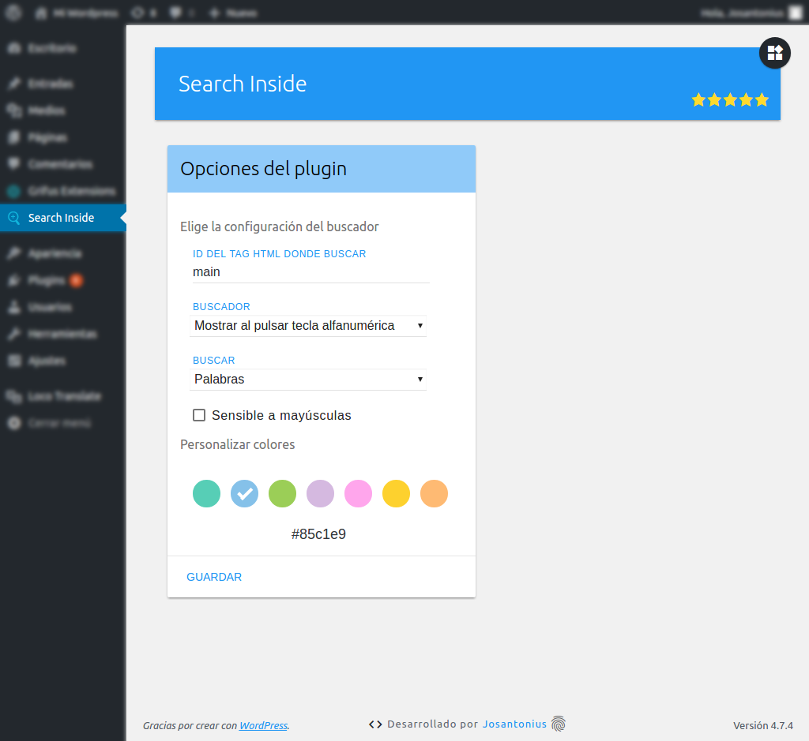
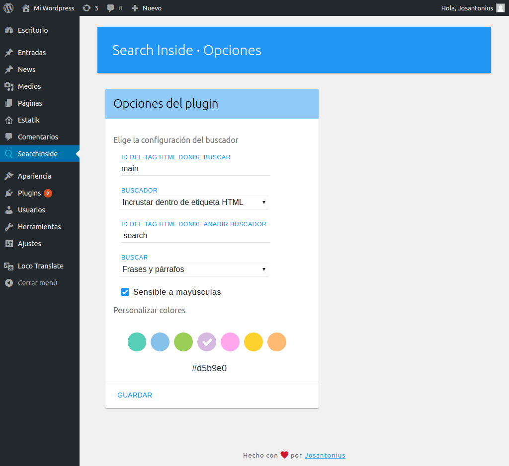
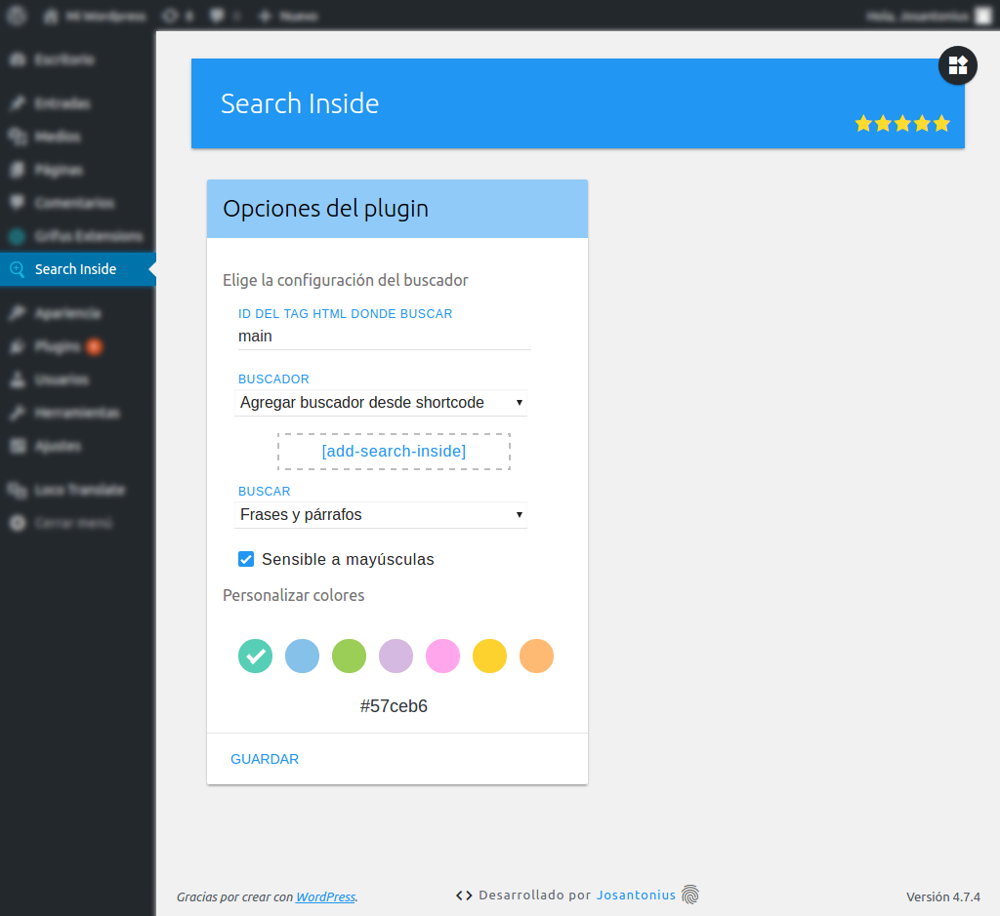
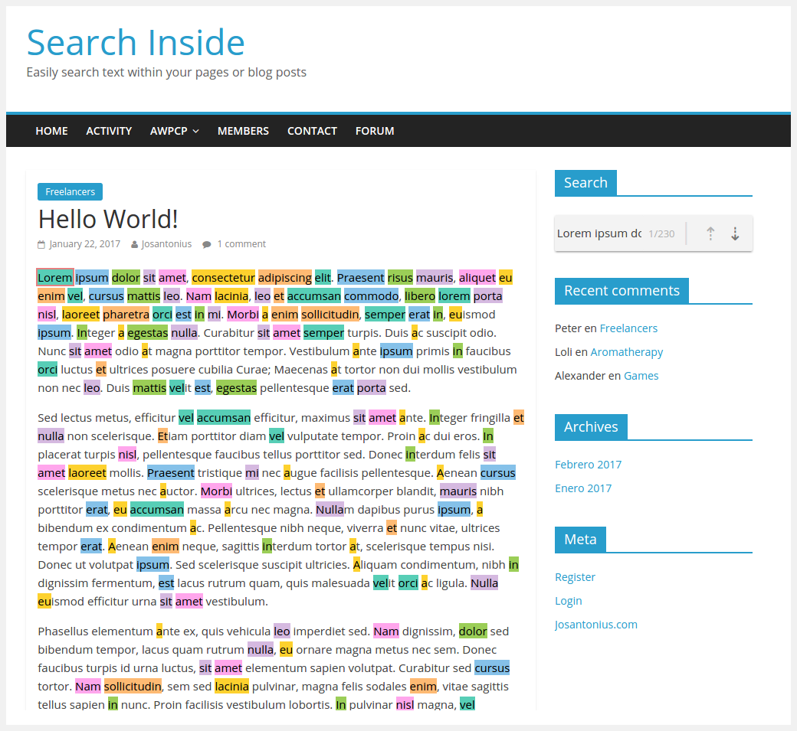
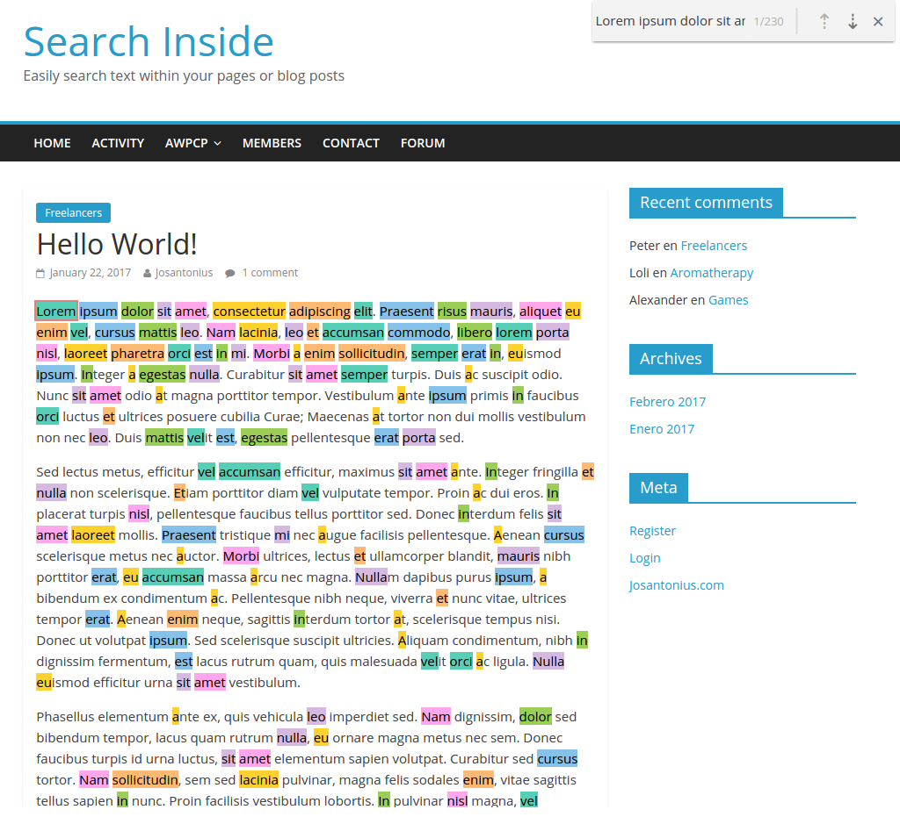
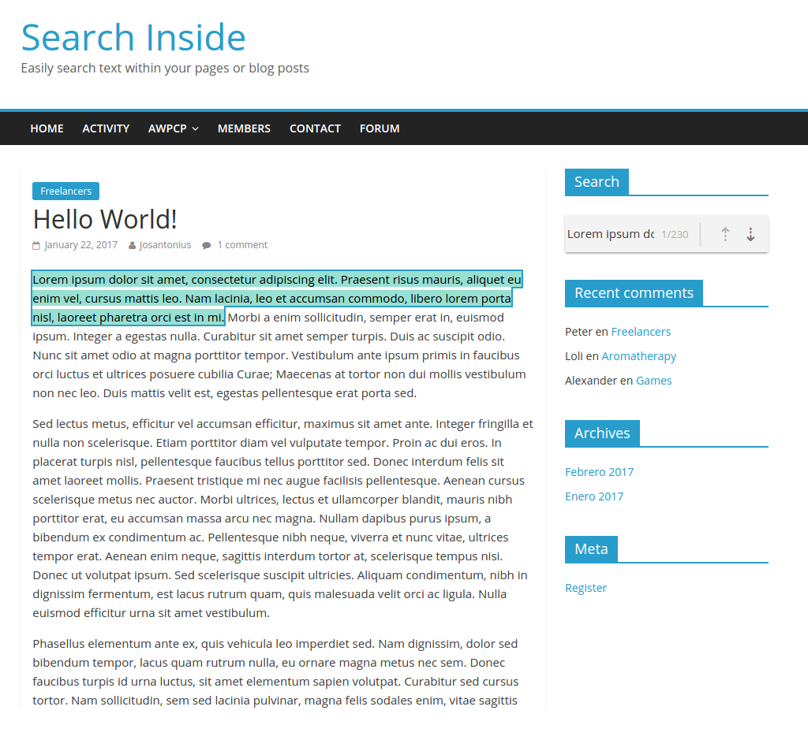
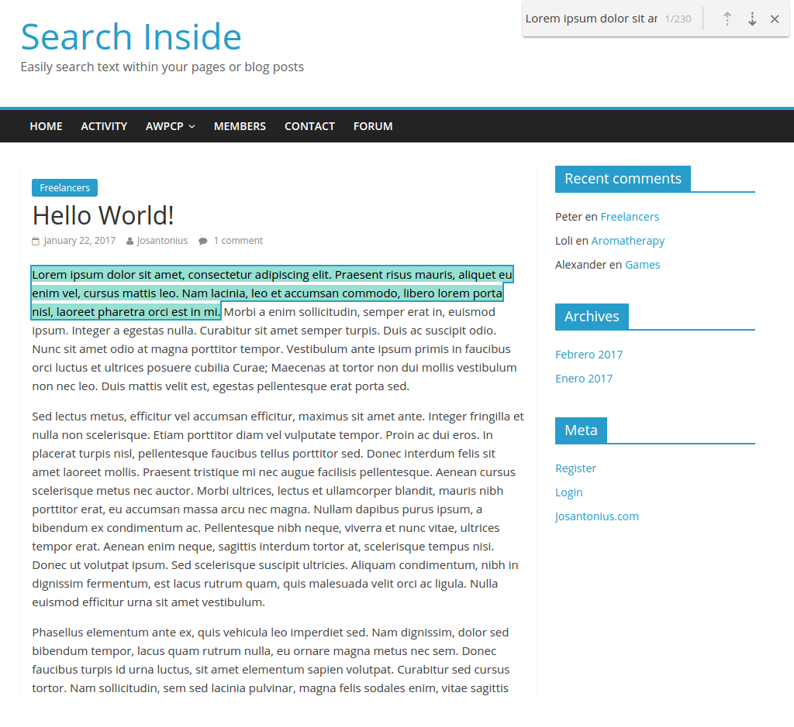

# Search Inside WordPress Plugin

[English version](README.md)

Busca y remarca fácilmente frases o palabras en páginas y entradas.

---

- [Requisitos](#requisitos)
- [Instalación](#instalación)
- [Imágenes](#imagenes)
- [Tests](#tests)
- [Licencia](#licencia)
- [Patrocinar](#patrocinar)

---

Con Search Inside ahora puedes realizar búsquedas dentro de tus publicaciones o páginas en WordPress.

**Tienes varias formas para mostrar el buscador**

- El motor de búsqueda aparece cuando se pulsa cualquier tecla alfanumérica.

- Incrustrado en una etiqueta HTML.

- Insertarlo desde shortcode.

**Dos modos de búsqueda**

- Buscar frases completas.

- Buscar palabras separadas por espacios.

¡No olvides activar el modo sensible a mayúsculas y minúsculas si lo necesitas!

**Search Inside posee soporte completo para codificación UTF-8 y puede realizar búsquedas en cualquier idioma.**

  

## Requisitos

Este plugin es soportado por versiones de **PHP 5.6** o superiores y es compatible con versiones de **HHVM 3.0** o superiores.

## Instalación

Puedes instalar este plugin desde el [repositorio oficial](https://es.wordpress.org/plugins/search-inside/) en WordPress.

Desde el panel de administración de WordPress:

 1. Entra en 'Plugins > Añadir Nuevo'
 2. Busca 'Search Inside'
 3. Activa Search Inside en tu página de plugins.

Desde WordPress.org:

 1. Descarga [Search Inside](https://es.wordpress.org/plugins/search-inside/).
 2. Sube el directorio 'search-inside' a tu directorio '/ wp-content / plugins /', usando tu método favorito (ftp, sftp, scp, etc ...).
 3. Activa Search Inside en tu página de plugins.

Una vez activado:

Entra en `Search Inside > Opciones` para configurar el plugin.

## Imágenes

### Tests

Para ejecutar las [pruebas](tests) necesitarás [Composer](http://getcomposer.org/download/) y seguir los siguientes pasos:

    git clone https://github.com/josantonius/wp-search-inside.git
    
    cd wp-search-inside

    composer install

Ejecutar pruebas unitarias con [PHPUnit](https://phpunit.de/):

    composer phpunit

Ejecutar pruebas de estándares de código para [WordPress](https://github.com/WordPress-Coding-Standards/WordPress-Coding-Standards/) con [PHPCS](https://github.com/squizlabs/PHP_CodeSniffer):

    composer phpcs

Ejecutar pruebas con [PHP Mess Detector](https://phpmd.org/) para detectar inconsistencias en el estilo de codificación:

    composer phpmd

Ejecutar todas las pruebas anteriores:

    composer tests

## Patrocinar

Si este proyecto te ayuda a reducir el tiempo de desarrollo,
[puedes patrocinarme](https://github.com/josantonius/lang/es-ES/README.md#patrocinar)
para apoyar mi trabajo :blush:

## Licencia

Este repositorio tiene una licencia [GPL-2.0+ License](LICENSE).

Copyright © 2017-2022, [Josantonius](https://github.com/josantonius/lang/es-ES/README.md#contacto)
