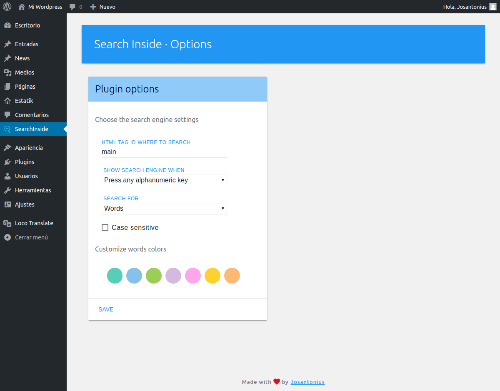
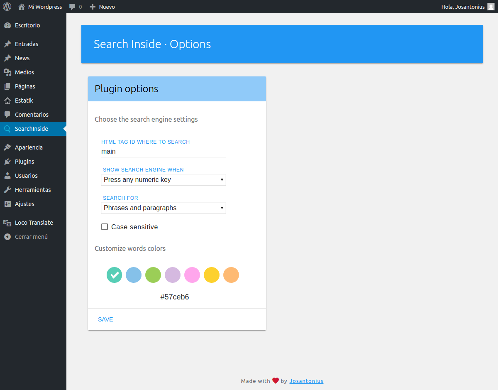
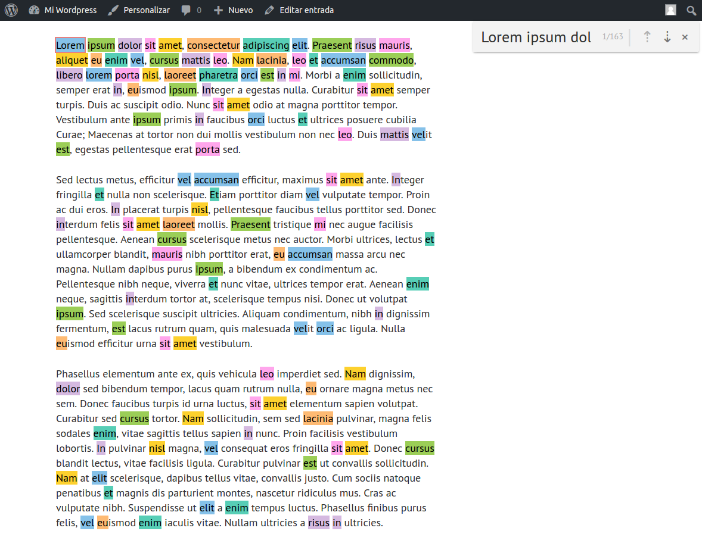
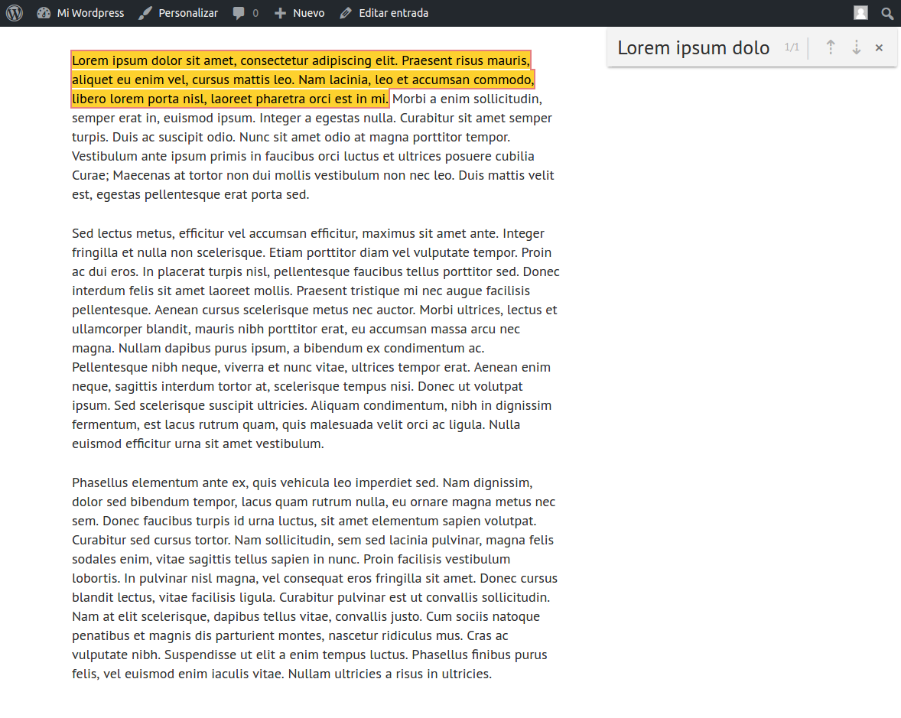

# Search Inside Wordpress Plugin

   

[Spanish version](README-ES.md)

Easily search text within your pages or blog posts.

---

- [Installation](#installation)
- [Requirements](#requirements)
- [Images](#images)
- [Contribute](#contribute)
- [Author](#author)
- [Licensing](#licensing)

---

### Installation

You can download this plugin from the [official repository](https://es.wordpress.org/plugins/search-inside/) in WordPress.

From your WordPress dashboard:

	1. Visit 'Plugins > Add New'
	2. Search for 'Search Inside'
	3. Activate Search Inside from your Plugins page.

From WordPress.org:

	1. Download [Search Inside](https://es.wordpress.org/plugins/search-inside/).
	2. Upload the 'search-inside' directory to your '/wp-content/plugins/' directory, using your favorite method (ftp, sftp, scp, etc...).
	3. Activate Search Inside from your Plugins page.

Once Activated:

	Visit 'Search Inside > Options' to configure the plugin.

### Requirements

This pluggin is supported by PHP versions 5.3 or higher and is compatible with HHVM versions 3.0 or higher.

### Images

### Contribute
1. Check for open issues or open a new issue to start a discussion around a bug or feature.
1. Fork the repository on GitHub to start making your changes.
1. Write one or more tests for the new feature or that expose the bug.
1. Make code changes to implement the feature or fix the bug.
1. Send a pull request to get your changes merged and published.

This is intended for large and long-lived objects.

### Author

Maintained by [Josantonius](https://github.com/Josantonius/).

### Licensing

This project is licensed under **GPLv2 license**. See the [LICENSE](license/LICENSE) file for more info.