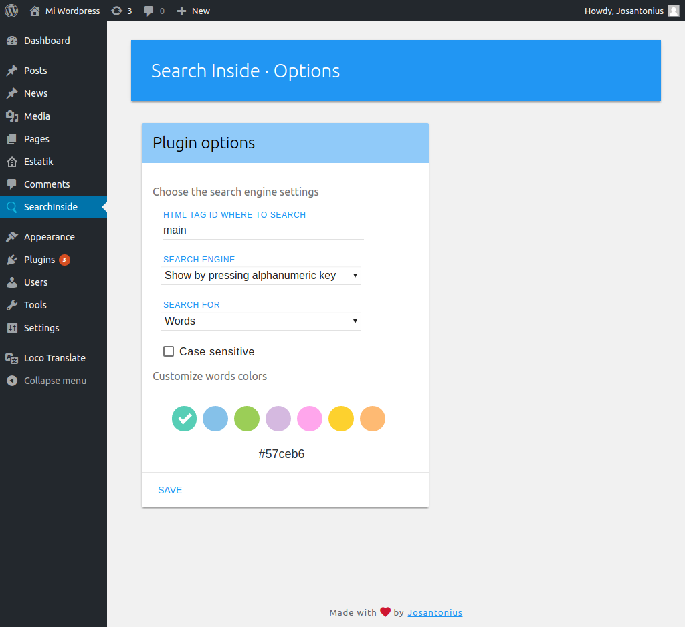
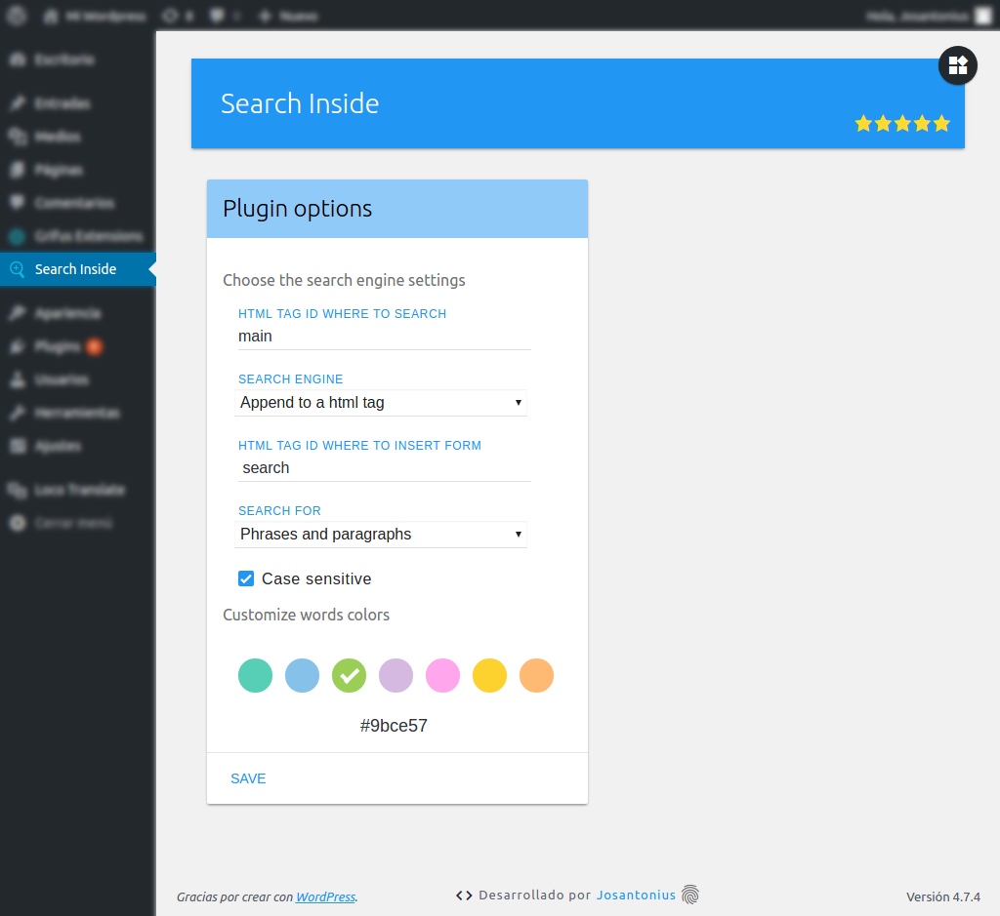

# Search Inside Wordpress Plugin

   

[Versión en español](README-ES.md)

Easily search text within your pages or blog posts.

---

- [Installation](#installation)
- [Requirements](#requirements)
- [Images](#images)
- [Contribute](#contribute)
- [Licensing](#licensing)
- [Copyright](#copyright)

---

With Search Inside now you can search within your posts or pages. 

  

**There are different ways to display the search engine**

- The search engine appears when you press any alphabetic or numeric key.

- Appended on a HTML tag.

- Inserted from a shortcode.

**Two search modes**

- Look for complete sentences.

- Search words separated by spaces. 

Don't forget to turn on case sensitive mode if you need it!

### Installation

You can download this plugin from the [official repository](https://es.wordpress.org/plugins/search-inside/) in WordPress.

From [Composer](http://getcomposer.org/download/). In the root folder of WordPress run:

    $ composer require josantonius/search-inside

The previous command will only install the necessary files, if you prefer to download the entire source code (including tests, vendor folder, exceptions not used, docs...) you can use:

    $ composer require josantonius/search-inside --prefer-source

Or you can also clone the complete repository with Git:

	$ git clone https://github.com/Josantonius/WP-SearchInside.git

From your WordPress dashboard:

	1. Visit 'Plugins > Add New'
	2. Search for 'Search Inside'
	3. Activate Search Inside from your Plugins page.

From WordPress.org:

	1. Download [Search Inside](https://es.wordpress.org/plugins/search-inside/).
	2. Upload the 'search-inside' directory to your '/wp-content/plugins/' directory, using your favorite method (ftp, sftp, scp, etc...).
	3. Activate Search Inside from your Plugins page.

Once Activated:

	Visit 'Search Inside > Options' to configure the plugin.

### Requirements

This pluggin is supported by PHP versions 5.3 or higher and is compatible with HHVM versions 3.0 or higher.

### Images

### Contribute
1. Check for open issues or open a new issue to start a discussion around a bug or feature.
1. Fork the repository on GitHub to start making your changes.
1. Write one or more tests for the new feature or that expose the bug.
1. Make code changes to implement the feature or fix the bug.
1. Send a pull request to get your changes merged and published.

This is intended for large and long-lived objects.

### Licensing

This project is licensed under **GPL-2.0+**. See the [LICENSE](LICENSE) file for more info.

### Copyright

2017 Josantonius, [josantonius.com](https://josantonius.com/)

If you find it useful, let me know :wink:

You can contact me on [Twitter](https://twitter.com/Josantonius) or through my [email](mailto:hello@josantonius.com).